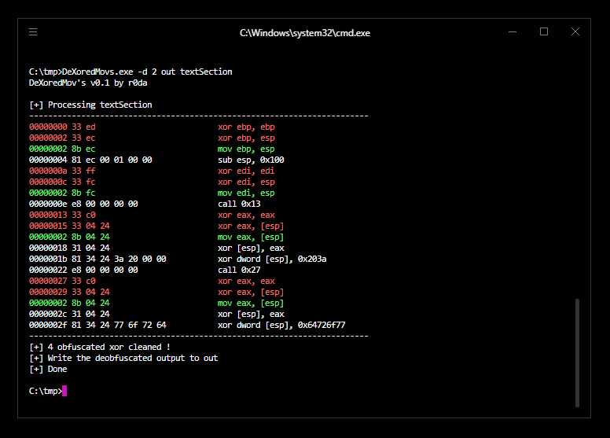

# DeXoredMovs
A xored mov's deobfuscator for intel x86 asm

## Intro

In intel x86 asm, mov instructions can be obfuscated like this :

```asm
# original instruction
mov eax, [esp]    # eax <- [esp]

# obfuscated
xor eax, eax      # eax <- 0
xor eax, [esp]    # eax(0) ^= [esp] : eax <- [esp]
```

So my tool just loop over all instructions of a code section buffer and replace each obfuscated xor operations by the original

I will update this tool with a full executable modification (just specify the executable in args and this will change the section) when my [Serana Library](https://github.com/whereisr0da/Serana-Lib) have the modification update. 



## Dependencies
A cool C# disassembler lib : [SharpDisasm](https://github.com/spazzarama/SharpDisasm)

## Usage

```
usages : [options] [output] [input]
         -d 0 : show disassembly of the code
            1 : show old xor before deobfuscation
            2 : show old xor before deobfuscation without nops
         -h : show usages
```

## Example

```
DeXoredMovs.exe codeSectionCleaned _text
DeXoredMovs.exe -d 1 codeSectionCleaned _text
```

## License
[Creative Commons Attribution-NonCommercial-NoDerivatives](http://creativecommons.org/licenses/by-nc-nd/4.0/)
